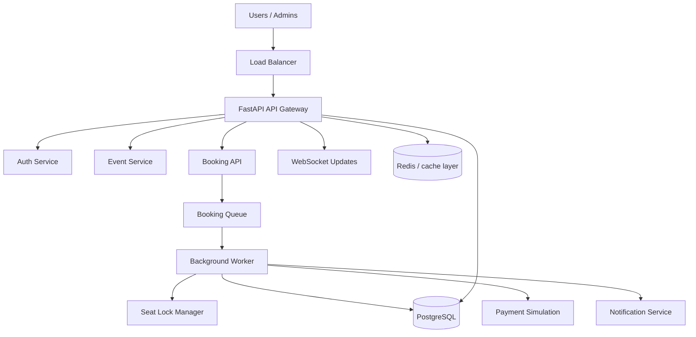

# Architecture

## Goal

Build a booking platform that keeps duplicate seat assignments at zero while handling very large spikes in booking requests.

## System Shape

## Safety layers

1. Idempotency key per booking request.
2. Seat-level lock before reservation.
3. Transactional reservation in the database.
4. Unique constraints on booking and seat mappings.
5. Worker-driven processing to smooth request spikes.

## Why this works

The queue absorbs traffic spikes. Locks prevent concurrent workers from racing the same seat. Database constraints and transactions make the state machine durable even if a request retries or a worker fails mid-flight.
