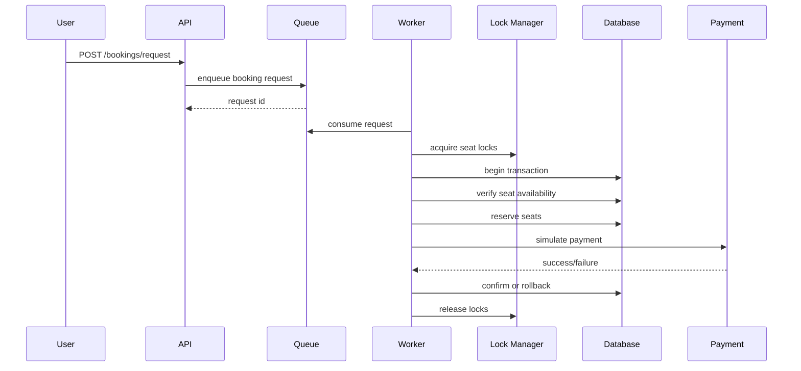
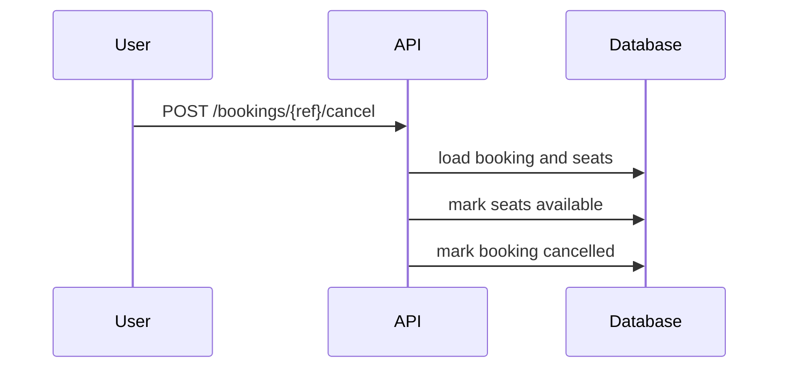

# Sequence Diagrams

## Booking request

```mermaid
sequenceDiagram
  participant U as User
  participant A as API
  participant Q as Queue
  participant W as Worker
  participant L as Lock Manager
  participant D as Database
  participant P as Payment

  U->>A: POST /bookings/request
  A->>Q: enqueue booking request
  Q-->>A: request id
  W->>Q: consume request
  W->>L: acquire seat locks
  W->>D: begin transaction
  W->>D: verify seat availability
  W->>D: reserve seats
  W->>P: simulate payment
  P-->>W: success/failure
  W->>D: confirm or rollback
  W->>L: release locks
```

## Cancellation

```mermaid
sequenceDiagram
  participant U as User
  participant A as API
  participant D as Database

  U->>A: POST /bookings/{ref}/cancel
  A->>D: load booking and seats
  A->>D: mark seats available
  A->>D: mark booking cancelled
```
